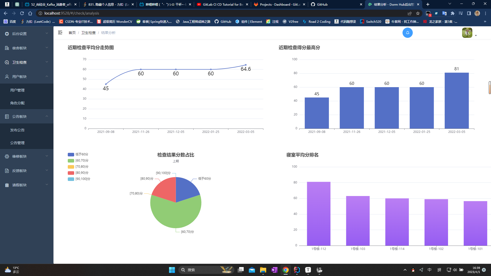

# dorm_hub
## 高校宿舍交流信息管理平台
~~[PC端在线演示地址](http://49.235.92.49/) 云主机欠费~~



### 项目概述
可用作毕业设计，主要供师生使用的以宿舍生活管理为主体的系统。还有很多地方需要完善和优化。
项目由移动端网页，PC端网页，后端服务三个部分构成。

### 目录结构
```
|——dorm-hub-parent 后端代码 [运行sql文件，自行配置application-dev]
|
|——dorm-web 前端代码
    |——dorm-admin PC端项目 [npm install + npm run dev]
    |——dorm-web 移动端项目 [npm install + npm run serve,不再更新]
```
移动端和PC端共用一套接口，现只维护PC端页面，可根据swagger文档自己编写移动端代码。

### 包含功能
1. [x] 卫生检查
2. [x] 预约床位
3. [x] 请假
4. [x] 报修
5. [x] 校内论坛
6. [x] 单人聊天
7. [x] 权限管理
### 开发涉及技术
- SpringBoot 2.5.X
- SpringSecurity + Jwt
- Mybatis-Plus
- MySQL 8.0+
- redis
- easy-poi
- 腾讯云 对象储存COS
- stomp & websocket
- Vue全家桶
- Vant UI & Element UI
- vue-admin-template
- ECharts
- Docker
- RabbitMQ
